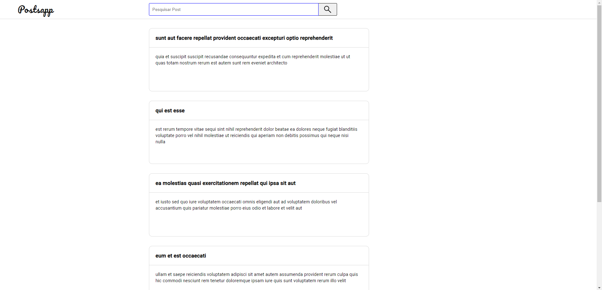
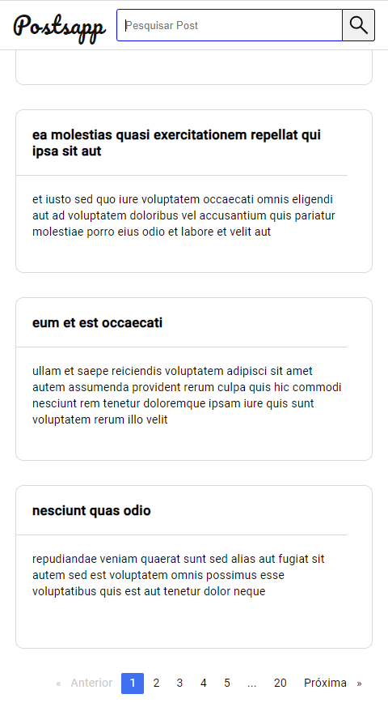

# User Function - aplicação simples com acesso à conteúdo externo

### Screenshot Desktop

 <h3>Screenshot Mobile</h3>

## My process

### Built with

- Semantic HTML5 markup
- SCSS custom properties
- Media queries
- Flexbox
- TypeScript
- Angular
- Angular Reactive forms
- Rxjs

### Continued development

Eu gostaria de me aprofundar no web design para dispositivos móveis e criar aplicativos cada vez mais responsivos, em projetos onde eu pudesse usar frameworks baseados em componentes.
